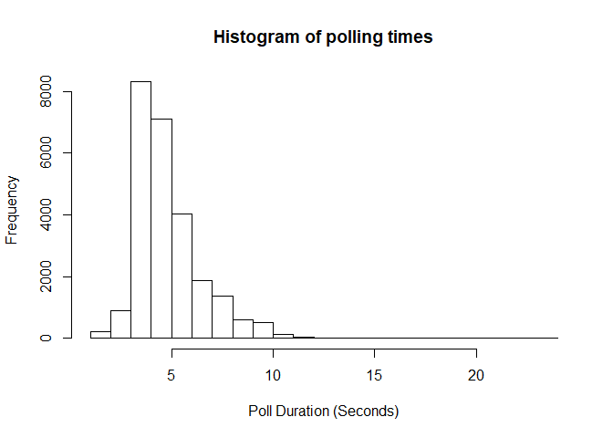
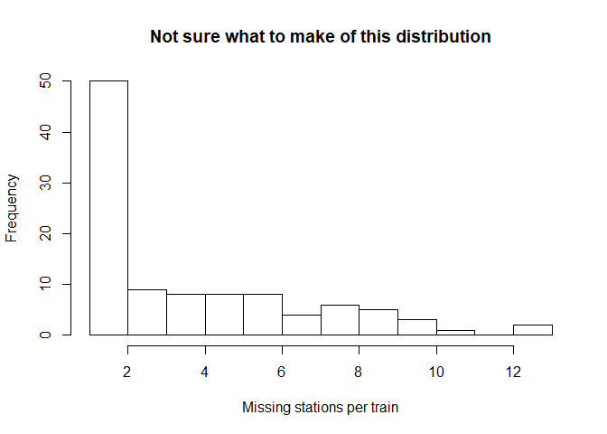
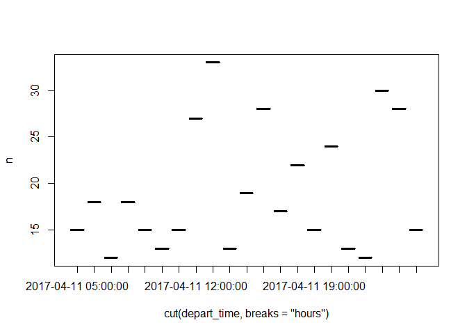

## Import the data
I haven't yet gotten a Postgres database working on my computer, so I've just downloaded one of the .csv dumps off SpiderOak. Figure I can write the filtering code first.


```r
list.files(file_location)
```

```
## [1] "ntas_data.csv" "polls.csv"     "requests.csv"
```

```r
polls     <- read_csv(paste0(file_location, "polls.csv"))
```

```
## Parsed with column specification:
## cols(
##   pollid = col_integer(),
##   poll_start = col_datetime(format = ""),
##   poll_end = col_datetime(format = "")
## )
```

```r
requests  <- read_csv(paste0(file_location, "requests.csv"))
```

```
## Parsed with column specification:
## cols(
##   requestid = col_integer(),
##   data_ = col_character(),
##   stationid = col_integer(),
##   lineid = col_integer(),
##   all_stations = col_character(),
##   create_date = col_datetime(format = ""),
##   pollid = col_integer(),
##   request_date = col_datetime(format = "")
## )
```

```r
ntas_data <- read_csv(paste0(file_location, "ntas_data.csv"))
```

```
## Parsed with column specification:
## cols(
##   requestid = col_integer(),
##   id = col_double(),
##   station_char = col_character(),
##   subwayline = col_character(),
##   system_message_type = col_character(),
##   timint = col_double(),
##   traindirection = col_character(),
##   trainid = col_integer(),
##   train_message = col_character()
## )
```

## Lets have a look inside the tables
###Polls

```r
glimpse(polls)
```

```
## Observations: 25,103
## Variables: 3
## $ pollid     <int> 4, 5, 6, 7, 8, 9, 10, 11, 12, 13, 14, 15, 16, 17, 1...
## $ poll_start <dttm> 2017-03-23 23:00:02, 2017-03-23 23:01:02, 2017-03-...
## $ poll_end   <dttm> 2017-03-23 23:00:07, 2017-03-23 23:01:10, 2017-03-...
```

```r
range(polls$poll_start)
```

```
## [1] "2017-03-23 23:00:02 UTC" "2017-04-19 18:22:02 UTC"
```

```r
hist(as.numeric(polls$poll_end - polls$poll_start), main = "Histogram of polling times", xlab = "Poll Duration (Seconds)")
```

<!-- -->

Looks like this dump was from the end of March 23 to sometime April 19th. Most polls took less than 5 seconds to execute, hardly any more than 10 seconds.

###Requests

```r
glimpse(requests)
```

```
## Observations: 1,665,140
## Variables: 8
## $ requestid    <int> 205, 206, 207, 208, 209, 210, 211, 212, 213, 214,...
## $ data_        <chr> NA, NA, NA, NA, NA, NA, NA, NA, NA, NA, NA, NA, N...
## $ stationid    <int> 1, 2, 3, 4, 5, 6, 7, 8, 9, 10, 11, 12, 13, 14, 15...
## $ lineid       <int> 1, 1, 1, 1, 1, 1, 1, 1, 1, 1, 1, 1, 1, 1, 1, 1, 1...
## $ all_stations <chr> "success", "success", "success", "success", "succ...
## $ create_date  <dttm> 2017-03-23 23:00:03, 2017-03-23 23:00:03, 2017-0...
## $ pollid       <int> 4, 4, 4, 4, 4, 4, 4, 4, 4, 4, 4, 4, 4, 4, 4, 4, 4...
## $ request_date <dttm> 2017-03-23 23:00:02, 2017-03-23 23:00:02, 2017-0...
```

```r
sum(requests$all_stations != "success")
```

```
## [1] 0
```

All the requests for this dump were successful.

###Ntas Data

```r
glimpse(ntas_data)
```

```
## Observations: 10,872,658
## Variables: 9
## $ requestid           <int> 1138391, 1138391, 1138392, 1138392, 113839...
## $ id                  <dbl> 13465823196, 13465823197, 13465823357, 134...
## $ station_char        <chr> "EGL2", "EGL2", "LAW1", "LAW1", "LAW1", "L...
## $ subwayline          <chr> "YUS", "YUS", "YUS", "YUS", "YUS", "YUS", ...
## $ system_message_type <chr> "Normal", "Normal", "Normal", "Normal", "N...
## $ timint              <dbl> 3.1525029, 5.7913291, 0.0000000, 4.4072469...
## $ traindirection      <chr> "South", "South", "North", "North", "North...
## $ trainid             <int> 145, 146, 159, 101, 102, 146, 147, 148, 15...
## $ train_message       <chr> "Arriving", "Arriving", "AtStation", "Arri...
```

So the data is 

## Tidying the Data

```r
data_raw <- ntas_data %>%
  left_join(requests, by = c("requestid" = "requestid")) %>%
  left_join(polls, by = c("pollid" = "pollid")) %>%  #Join to get timestamps
  filter((subwayline == "YUS"  & lineid == 1) | # Some entries have stations on the incorrect line
         (subwayline == "BD"   & lineid == 2) |
         (subwayline == "SHEP" & lineid == 4) ) %>%
  select(-data_, -system_message_type, -all_stations, -requestid, -pollid, -lineid) #superfluous columns

head(data_raw)
```

```
## # A tibble: 6 x 12
##            id station_char subwayline   timint traindirection trainid
##         <dbl>        <chr>      <chr>    <dbl>          <chr>   <int>
## 1 13465823196         EGL2        YUS 3.152503          South     145
## 2 13465823197         EGL2        YUS 5.791329          South     146
## 3 13465823357         LAW1        YUS 0.000000          North     159
## 4 13465823358         LAW1        YUS 4.407247          North     101
## 5 13465823359         LAW1        YUS 7.421122          North     102
## 6 13465823192         LAW2        YUS 1.393371          South     146
## # ... with 6 more variables: train_message <chr>, stationid <int>,
## #   create_date <dttm>, request_date <dttm>, poll_start <dttm>,
## #   poll_end <dttm>
```

```r
stations <- data_raw %>%
  group_by(station_char, stationid, traindirection) %>%
  summarize()

head(stations)
```

```
## # A tibble: 6 x 3
## # Groups:   station_char, stationid [6]
##   station_char stationid traindirection
##          <chr>     <int>          <chr>
## 1         BAT1        46           East
## 2         BAT2        46           West
## 3         BAU1        49           East
## 4         BAU2        49           West
## 5         BLO1        22          North
## 6         BLO2        22          South
```

### Selecting just one day to look at first


```r
one_day <- data_raw %>%
  mutate(workday = cut(request_date - hours(5), breaks = "days")) %>% #TTC days extend past midnight into the next
  filter(workday == "2017-04-11") %>%
  arrange(poll_start)
```

### Selecting just one train that day to look at


```r
one_train_day <- one_day %>%
  filter(trainid == "102")

print(one_train_day, n = 20)
```

```
## # A tibble: 2,630 x 13
##             id station_char subwayline    timint traindirection trainid
##          <dbl>        <chr>      <chr>     <dbl>          <chr>   <int>
##  1 13453869257         WIL1        YUS 0.5350376          North     102
##  2 13453868292         YKD1        YUS 2.6540987          North     102
##  3 13453884912         YKD1        YUS 1.8640612          North     102
##  4 13453884916         LWW1        YUS 3.9861106          North     102
##  5 13453900553         YKD1        YUS 0.6275294          North     102
##  6 13453900558         LWW1        YUS 2.7495788          North     102
##  7 13453900561         GCN1        YUS 4.1729788          North     102
##  8 13453917035         YKD1        YUS 0.0000000          North     102
##  9 13453917039         LWW1        YUS 2.1220494          North     102
## 10 13453917043         GCN1        YUS 3.5454494          North     102
## 11 13453932834         LWW1        YUS 1.7152471          North     102
## 12 13453932837         GCN1        YUS 3.1386471          North     102
## 13 13453932841         EGW1        YUS 5.0509224          North     102
## 14 13453949287         LWW1        YUS 0.3287059          North     102
## 15 13453949291         GCN1        YUS 1.7521059          North     102
## 16 13453949295         EGW1        YUS 3.6643812          North     102
## 17 13453965304         LWW1        YUS 0.0000000          North     102
## 18 13453965307         GCN1        YUS 1.4234000          North     102
## 19 13453965311         EGW1        YUS 3.3356753          North     102
## 20 13453980907         GCN1        YUS 0.2587812          North     102
## # ... with 2,610 more rows, and 7 more variables: train_message <chr>,
## #   stationid <int>, create_date <dttm>, request_date <dttm>,
## #   poll_start <dttm>, poll_end <dttm>, workday <fctr>
```

### Still too many entries

Filtering the results for only the closest station per time period, as long as ia minute away.

I'm not entirely sure how to best filter these.
*I like selecting only the minimum timint for a period, as there's only one closest station to a train, however that leaves out data for trains between stations too often.
*To combat that I reluctantly added back in entries with timint < ~1 minute
* A better strategy might be to allow two entries for timestamps, if the first is in the station? Need to think about that some more


```r
one_train_day_nearest <- one_train_day %>%
  group_by(poll_start) %>%
  filter(timint == min(timint) & 
         timint <= 1.10) %>% 
  ungroup()
```

### Transform Data grouped by station observations into train trips
The purpose of the following chunk is to change the data structure from a station to a train orientation. Start to calculate differences in time between stations.

First we're going to calculate an estimated arrival time at the station, if there's no exact query when it's in station. We'll arrange the entries by this new time. 
This is where the issues are showing up mentioned in the chunk above. If there's a new delay, some of these entries will start to get intertwined.

Also added in this step is the 
*previous station where the train came from, 
*a rudimentary index of the number of station to station trips the train has made,
*indicator whether the station number is increasing or decreasing (to help capture short turns in the future)
*indicator if the train went out of service and back in later in the day. Train 102 went out of service ~10AM after morning rush, and back into service at ~4:20 for the evening.


```r
station_transits <- one_train_day_nearest %>%
  mutate(arrive_time        = request_date + seconds(round(timint * 60))) %>%
  arrange(arrive_time) %>%
  mutate(stationid_last     = dplyr::lag(stationid, default = stationid[1]),
         station_change     = stationid != stationid_last,
         station_change_num = cumsum(station_change),
         station_dir        = stationid - stationid_last,
         service_break      = arrive_time - lag(arrive_time, order_by = arrive_time, default = arrive_time[1]) > seconds(3600),
         daily_trip         = cumsum(service_break))

station_transits
```

```
## # A tibble: 379 x 20
##             id station_char subwayline    timint traindirection trainid
##          <dbl>        <chr>      <chr>     <dbl>          <chr>   <int>
##  1 13453869257         WIL1        YUS 0.5350376          North     102
##  2 13453900553         YKD1        YUS 0.6275294          North     102
##  3 13453917035         YKD1        YUS 0.0000000          North     102
##  4 13453949287         LWW1        YUS 0.3287059          North     102
##  5 13453965304         LWW1        YUS 0.0000000          North     102
##  6 13453980907         GCN1        YUS 0.2587812          North     102
##  7 13454013508         EGW1        YUS 0.0000000          North     102
##  8 13454077546         SCW1        YUS 0.9236635          North     102
##  9 13454094658         SCW1        YUS 0.1234141          North     102
## 10 13454143087         DUP1        YUS 0.0000000          North     102
## # ... with 369 more rows, and 14 more variables: train_message <chr>,
## #   stationid <int>, create_date <dttm>, request_date <dttm>,
## #   poll_start <dttm>, poll_end <dttm>, workday <fctr>,
## #   arrive_time <dttm>, stationid_last <int>, station_change <lgl>,
## #   station_change_num <int>, station_dir <int>, service_break <lgl>,
## #   daily_trip <int>
```
## Tidying up things a bit more

With this chunk I want to 
*group up each of the station changes together and get the timestamp.
*grab the previous station
*Determine the trip(? don't know the domain terms, cumulative index increases every direction change)
*Calculate the duration between stations
*filter out the stuff that's not needed


```r
clean_transits <- station_transits %>%
  group_by(subwayline, trainid, daily_trip, station_change_num) %>%
  summarize(stationid      = stationid[1],
            arrive_time    = min(arrive_time),
            direction      = sum(station_dir) > 0) %>%
  ungroup() %>%
  group_by(daily_trip) %>%
  mutate(depart_time      = dplyr::lag(arrive_time),
         trip             = cumsum(direction != lag(direction, default = TRUE)),
         origin_stationid = dplyr::lag(stationid),
         duration         = arrive_time - depart_time) %>%
  ungroup() %>%
  filter(!is.na(depart_time)) %>%
  select(subwayline, trainid, daily_trip, trip, origin_stationid, stationid, depart_time, arrive_time, duration)

print(clean_transits, n = 30)
```

```
## # A tibble: 243 x 9
##    subwayline trainid daily_trip  trip origin_stationid stationid
##         <chr>   <int>      <int> <int>            <int>     <int>
##  1        YUS     102          0     2                2         3
##  2        YUS     102          0     2                3         4
##  3        YUS     102          0     2                4         5
##  4        YUS     102          0     2                5         6
##  5        YUS     102          0     2                6         7
##  6        YUS     102          0     2                7         8
##  7        YUS     102          0     2                8         9
##  8        YUS     102          0     2                9        10
##  9        YUS     102          0     2               10        11
## 10        YUS     102          0     2               11        12
## 11        YUS     102          0     2               12        13
## 12        YUS     102          0     2               13        14
## 13        YUS     102          0     2               14        15
## 14        YUS     102          0     2               15        16
## 15        YUS     102          0     2               16        17
## 16        YUS     102          0     2               17        18
## 17        YUS     102          0     2               18        19
## 18        YUS     102          0     2               19        20
## 19        YUS     102          0     2               20        21
## 20        YUS     102          0     2               21        22
## 21        YUS     102          0     2               22        23
## 22        YUS     102          0     2               23        24
## 23        YUS     102          0     2               24        25
## 24        YUS     102          0     2               25        26
## 25        YUS     102          0     2               26        27
## 26        YUS     102          0     2               27        28
## 27        YUS     102          0     2               28        29
## 28        YUS     102          0     2               29        30
## 29        YUS     102          0     2               30        31
## 30        YUS     102          0     2               31        32
## # ... with 213 more rows, and 3 more variables: depart_time <dttm>,
## #   arrive_time <dttm>, duration <time>
```

```r
filter(clean_transits, abs(origin_stationid - stationid) > 1) #one trip that missed station 14 (Osgoode)
```

```
## # A tibble: 1 x 9
##   subwayline trainid daily_trip  trip origin_stationid stationid
##        <chr>   <int>      <int> <int>            <int>     <int>
## 1        YUS     102          1     6               13        15
## # ... with 3 more variables: depart_time <dttm>, arrive_time <dttm>,
## #   duration <time>
```

```r
arrange(clean_transits, desc(duration)) %>%
  head()
```

```
## # A tibble: 6 x 9
##   subwayline trainid daily_trip  trip origin_stationid stationid
##        <chr>   <int>      <int> <int>            <int>     <int>
## 1        YUS     102          1     6                1         2
## 2        YUS     102          0     3                7         6
## 3        YUS     102          1     7               32        31
## 4        YUS     102          1     4               31        32
## 5        YUS     102          1     4                1         2
## 6        YUS     102          1     4               29        30
## # ... with 3 more variables: depart_time <dttm>, arrive_time <dttm>,
## #   duration <time>
```
Looks reasonable so far off one train.

##All Trains
Now we've got the data set up in a standard format, time to loop through all the trains.

Pretty much going to combine all the stuff from above into one big function. Run it through a loop and bind all the rows together.

```r
one_day_trains <- unique(one_day$trainid)

train_tripifier <- function(train) {
  one_day %>%
  filter(trainid == train) %>%    group_by(poll_start) %>%
  filter(timint == min(timint) & timint <= 1.15) %>%
  ungroup() %>%
  mutate(arrive_time        = request_date + seconds(round(timint * 60))) %>%
  arrange(arrive_time) %>%
  mutate(stationid_last     = dplyr::lag(stationid, default = stationid[1]),
         station_change     = stationid != stationid_last,
         station_change_num = cumsum(station_change),
         station_dir        = stationid - stationid_last,
         service_break      = arrive_time - lag(arrive_time, order_by = arrive_time, default = arrive_time[1]) > seconds(3600),
         daily_trip         = cumsum(service_break)) %>%
  group_by(subwayline, trainid, daily_trip, station_change_num) %>%
  summarize(stationid      = stationid[1],
            arrive_time    = min(arrive_time),
            direction      = sum(station_dir) > 0) %>%
  ungroup() %>%
  group_by(daily_trip) %>%
  mutate(depart_time      = dplyr::lag(arrive_time),
         trip             = cumsum(direction != lag(direction, default = TRUE)),       
         origin_stationid = dplyr::lag(stationid),
         duration         = arrive_time - depart_time) %>%
  ungroup() %>%
  filter(!is.na(depart_time)) %>%
  select(subwayline, trainid, daily_trip, trip, origin_stationid, stationid, depart_time, arrive_time, duration) %>%
  return()
}

one_day_trip <- map(one_day_trains, train_tripifier) %>%
  bind_rows()
```

### What's inside?
First thing I'm looking for are the entries where a station got missed. I wonder how many of these are instances where a train bypassed the station, and how many are instances where the minute resolution of the scanner missed a stop. Are there any patterns between stations. Are there any patterns with trains? Patterns with time?

Ultimately this section here will influence how I filter out / wrangle the data above.

```r
one_day_trip %>%
  filter(abs(origin_stationid - stationid) > 1) %>%
  nrow()
```

```
## [1] 402
```

```r
one_day_trip %>%
  filter(abs(origin_stationid - stationid) > 1) %>%
  group_by(origin_stationid, stationid) %>%
  count() %>%
  arrange(desc(n))
```

```
## # A tibble: 114 x 3
## # Groups:   origin_stationid, stationid [114]
##    origin_stationid stationid     n
##               <int>     <int> <int>
##  1               13        15   159
##  2                4         6    17
##  3               27        29    12
##  4               65        67    10
##  5               20        18     9
##  6               64        66     8
##  7               17        19     6
##  8               15        13     5
##  9               50        48     5
## 10               66        68     5
## # ... with 104 more rows
```

```r
filter(one_day_trip, abs(origin_stationid - stationid) > 1) %>%
  group_by(trainid) %>%
  count() %>%
  arrange(desc(n)) %>%
  print(n = 10) %$%
  hist(.$n, main = "Not sure what to make of this distribution", xlab = "Missing stations per train", breaks = 15)
```

```
## # A tibble: 104 x 2
## # Groups:   trainid [104]
##    trainid     n
##      <int> <int>
##  1     128    13
##  2     464    13
##  3     462    11
##  4     111    10
##  5     123    10
##  6     157    10
##  7     101     9
##  8     103     9
##  9     117     9
## 10     121     9
## # ... with 94 more rows
```

<!-- -->

```r
filter(one_day_trip, abs(origin_stationid - stationid) > 1) %>%
  group_by(cut(depart_time, breaks = "hours")) %>%
  count() %>%
  print() %>%
  plot()
```

```
## # A tibble: 21 x 2
## # Groups:   cut(depart_time, breaks = "hours") [21]
##    `cut(depart_time, breaks = "hours")`     n
##                                  <fctr> <int>
##  1                  2017-04-11 05:00:00    15
##  2                  2017-04-11 06:00:00    18
##  3                  2017-04-11 07:00:00    12
##  4                  2017-04-11 08:00:00    18
##  5                  2017-04-11 09:00:00    15
##  6                  2017-04-11 10:00:00    13
##  7                  2017-04-11 11:00:00    15
##  8                  2017-04-11 12:00:00    27
##  9                  2017-04-11 13:00:00    33
## 10                  2017-04-11 14:00:00    13
## # ... with 11 more rows
```

<!-- -->

*402 of these gaps. ~1% of the trips. Not super high, but reliability is at the margins? Going to try getting this down.

*Osgoode definitely is where it's happening the most, almost 40%

*Majority of trains only missed one. Going to look more into 128 and 464.

*Time of day doesn't seem to have an obvious pattern, but this is only one day. Higher around noon-1ish and midnight-1ish.


#Summary stats for trips
Not really paying attention to this so much until I do a better job of the data wrangling.

```r
one_day_trip %>%
  group_by(subwayline, origin_stationid, stationid) %>%
  summarise(median = median(duration),
            sd = sd(duration),
            n = n())
```

```
## # A tibble: 244 x 6
## # Groups:   subwayline, origin_stationid [?]
##    subwayline origin_stationid stationid         median            sd
##         <chr>            <int>     <int>         <time>        <time>
##  1         BD               33        34 354.85914 secs 83.80592 secs
##  2         BD               33        35 474.22690 secs 17.17776 secs
##  3         BD               33        36 545.10500 secs      NaN secs
##  4         BD               34        33 177.86526 secs 55.33429 secs
##  5         BD               34        35 132.37202 secs 35.20857 secs
##  6         BD               34        36 157.35344 secs      NaN secs
##  7         BD               35        33  97.11556 secs 56.95155 secs
##  8         BD               35        34 130.75806 secs 34.28464 secs
##  9         BD               35        36 120.16551 secs 23.30199 secs
## 10         BD               35        37 216.76733 secs 30.14767 secs
## # ... with 234 more rows, and 1 more variables: n <int>
```

